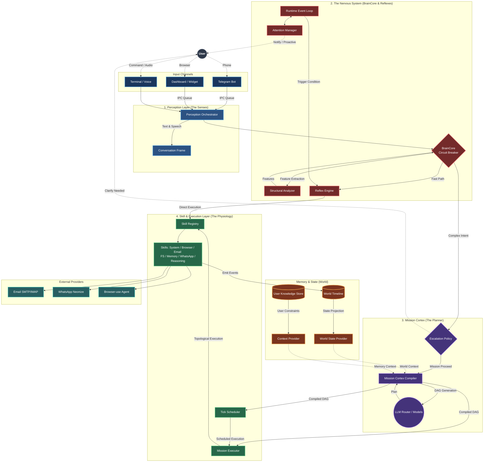
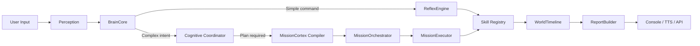
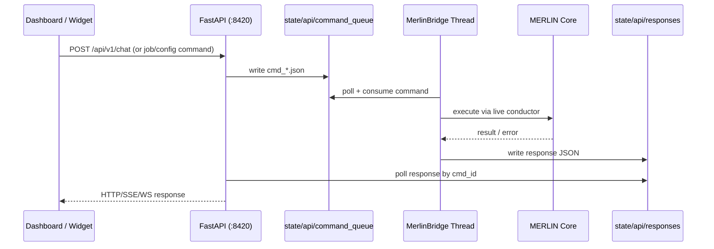

<div align="center">
  <h1>🧙‍♂️ MERLIN</h1>
  <p><strong>A multi-modal, determinism-first cognitive agent architecture.</strong></p>

  [](https://www.python.org/downloads/)
  
  
</div>

<br />

**MERLIN** is an advanced agentic system built for reliability, determinism, and deep operating system integration. 

Unlike traditional LLM wrappers that rely on chaotic ReAct loops and fragile prompt-injection execution, MERLIN introduces a strict **four-layer cognitive architecture** to separate *intelligence* (reasoning, comprehension) from *physiology* (execution, state mutation).

> **Core Philosophy:** *Intelligence is narrow, execution is broad. Structure replaces interpretation.*

---

## ✨ Superpowers & Capabilities

MERLIN is equipped to operate as a JARVIS-level assistant, featuring robust OS integrations and advanced context management.

* 💻 **Advanced OS Manipulation**: Natively control your OS via the `SystemController`. Open, close, and focus applications, manage media playback, check hardware metrics (battery, system load), and adjust display settings (brightness, volume, night light).
* 🧠 **Semantic User Memory**: A structured, versioned memory system (`UserKnowledgeStore`) that deterministically tracks user **facts**, **preferences**, **traits**, and **policies**. MERLIN remembers your preferences without needing an LLM to "re-learn" them every time.
* ⏱️ **Proactive Attention Management**: MERLIN doesn't just wait to be spoken to. It runs scheduled tasks, evaluates completion queues, and uses an `AttentionManager` to decide whether to *interrupt* you immediately, *queue* a notification for later, or *suppress* it entirely based on priority.
* 🌐 **File System & Browser Control**: Native capabilities to search, read, write to your local file system, and scrape/control the web browser.
* 🔀 **Granular LLM Routing**: Configure specific LLM providers (OpenRouter, Gemini, HuggingFace, Ollama) for specific cognitive tasks based on speed, cost, and intelligence requirements via `models.yaml`.
* 💬 **Multi-Channel Communication**: Send and receive messages via **WhatsApp** (neonize bridge) and **Telegram** (bot adapter), with email drafts and inbox reading via SMTP/IMAP.
* 🤖 **Telegram Remote Control**: Control MERLIN from your phone via a Telegram bot — whitelist-secured, serialized, with queue pressure guards and bridge liveness checks.
* 🖥️ **Professional Dashboard & Widget**: A React dashboard with 10 pages (system gauges, chat, mail, WhatsApp, scheduler, memory, logs, config, mission inspector, world state) and a PySide6 floating desktop widget — all communicating via a decoupled REST/WebSocket API.


---

## 🧠 The 4-Layer Architecture

MERLIN is divided into distinct execution layers, preventing hallucinations and enforcing strict operational contracts.



### 1. Perception Layer (The Senses)
Manages concurrent, multi-modal inputs. It handles text inputs and voice recognition simultaneously with explicit cancellation semantics (e.g., typing text immediately aborts an ongoing voice recording).
* Handles text through CLI prompts (`TextPerception`)
* Handles voice via Speech-to-Text inference (`SpeechPerception`)

### 2. The Nervous System (BrainCore & Reflexes)
The routing authority and fast-path execution loop. MERLIN doesn't invoke a heavy LLM for everything.
* **BrainCore Circuit Breaker:** Analyzes the structural features of an input. Simple commands bypass heavy cognitive processing entirely.
* **Reflex Engine:** A zero-LLM, deterministic reaction layer. If you say *"mute volume"*, MERLIN matches the intent and instantly invokes the skill, taking milliseconds instead of seconds.
* **Always-On Event Loop:** Listens to background events, dispatches scheduled background jobs, and triggers proactive reflexes.

### 3. Mission Cortex (The Planner)
When complex reasoning is required, the `MissionCortex` acts as an LLM-powered compiler.
* Translates natural language intent into a deterministic **Mission Plan (Directed Acyclic Graph)**.
* Enforces rigid Intermediate Representation (IR) validation. The plan is verified for correct skill arguments, routing, and dependencies *before* a single action is taken.

### 4. Skill & Execution Layer (The Physiology)
The non-cognitive layer that mutates the world.
* **MissionExecutor:** Executes the compiled DAG. Enables concurrent execution of parallel nodes.
* **Enforced Execution Contracts:** Skills are rigorously defined. An LLM cannot hallucinate arguments or manipulate the system in undefined ways.
* **Effect-Driven Inline Recovery:** When a node fails, the `DecisionEngine` classifies the failure, finds recovery actions via skill contract chains, and executes them inline — bounded, deduped, and safety-gated.
* **World State Timeline:** Every action, input, and response is tracked as an append-only event stream in the `WorldTimeline`, allowing MERLIN to maintain perfect contextual awareness of its environment.

### 🧭 Request Lifecycle (Control-Flow View)



---

## 🚧 Status

**v0.1.0** — Initial public release

- Core execution system is stable
- Text-based interaction fully supported
- OS control, file system, memory, and scheduling are production-ready
- Advanced integrations (browser automation, messaging, voice) are in active development

To access the full feature set including the dashboard UI, Telegram bot, browser control, and voice modes, clone the repository and follow the [Development Setup](#-development-setup) below.

---

## 🚀 Quick Start

**Prerequisites:** Python 3.10+ and an API key (OpenRouter, Gemini, or local Ollama).

```bash
pip install merlin-assistant
merlin init
merlin
```

`merlin init` walks you through provider selection, API key validation, and config generation. Once complete, try:

```
You: open notepad
You: what time is it
You: set volume to 50
```

---

## 👨‍💻 Development Setup

For contributors or users who want the full feature set (dashboard, voice, browser, Telegram, WhatsApp):

1. **Clone the repository:**
   ```bash
   git clone https://github.com/AlexxBenny/Merlin.git
   cd Merlin
   ```

2. **Create a virtual environment and install dependencies:**
   ```bash
   python -m venv .venv && source .venv/bin/activate && python -m pip install --upgrade pip && python -m pip install -e ".[dev]"
   ```
   On Windows PowerShell, activate with `.\.venv\Scripts\Activate.ps1` instead of `source .venv/bin/activate`.

    Optional feature extras:
    - `.[voice]` for local STT/TTS dependencies
    - `.[ui]` for the PySide6 desktop widget
    - `.[browser]` for browser-use integrations
    - `.[windows]` for Windows-only control integrations

3. **Set up API Keys:**
   ```bash
   cp .env.example .env
   ```
   Edit `.env` to include your provider API keys (e.g., `OPENROUTER_API_KEY`, `GEMINI_API_KEY`).

4. **Configure Models & Routing:**
   * Configure LLMs for specific roles in `config/models.yaml`.
   * Adjust routing policies in `config/routing.yaml`.
   * Tune execution behavior in `config/execution.yaml`, `config/browser.yaml`, and `config/skills.yaml`.

5. **Run MERLIN:**
   ```bash
   python main.py                  # Terminal-only mode
   python main.py --ui             # With dashboard + widget
   python main.py --telegram       # With Telegram bot adapter
   python main.py --ui --telegram  # Dashboard + Telegram
   python main.py --voice          # Voice-only mode
   python main.py --hybrid         # Text + voice
   ```
    When using `--ui`, the dashboard is available at `http://localhost:8420` and API docs at `http://localhost:8420/docs`.
    When using `--telegram`, configure `TELEGRAM_BOT_TOKEN` in `.env` and set `allowed_user_ids` in `config/telegram.yaml`.

### UI Frontend Development (Optional)

If you are developing the React dashboard, install frontend dependencies separately:

```bash
cd ui/dashboard
npm install
npm run dev    # http://localhost:5173 (proxied to API on :8420)
npm run build  # production build
```

### Environment Variables (Quick Reference)

Copy `.env.example` to `.env`, then set at least one provider key.

Required (at least one provider key):
- `OPENROUTER_API_KEY`
- `GEMINI_API_KEY`

Common optional variables:
- `TELEGRAM_BOT_TOKEN` (required for `--telegram` mode)
- `OLLAMA_HOST` (default: `http://localhost:11434`)
- `LOG_LEVEL` (default: `INFO`)
- `STT_ENGINE` / `TTS_ENGINE` (defaults: `whisper` / `pyttsx3`)
- `BROWSER_HEADLESS` (default: `false`)

### Configuration Quick Reference

Key files in `config/`:

| File | Purpose |
|------|---------|
| `models.yaml` | Role-based LLM provider/model routing |
| `routing.yaml` | BrainCore and escalation routing rules |
| `skills.yaml` | Skill registry metadata/configuration |
| `execution.yaml` | Executor concurrency, timeout, retries |
| `browser.yaml` | Browser headless/security/timeout settings |
| `email.yaml` | Email provider (SMTP/IMAP) configuration |
| `whatsapp.yaml` | WhatsApp connection and provider settings |
| `telegram.yaml` | Telegram bot whitelist, queue depth, timeout |
| `paths.yaml` | Filesystem alias mapping |
| `app_aliases.yaml` | App name alias normalization |
| `app_capabilities.yaml` | Per-app media capability flags |

### 🧪 Running Tests

```bash
# Run default test suite
python -m pytest -q

# Run tests marked as slow (live infra/network dependent)
python -m pytest -m slow
```

`@pytest.mark.slow` tests are excluded by default unless you explicitly run `-m slow`.

### 📦 Releasing

MERLIN package version is controlled in `pyproject.toml` (`[project].version`).

The release workflow at `.github/workflows/release.yml` runs on tags named `v*` and:
- verifies tag version matches `pyproject.toml`,
- runs tests,
- builds wheel + sdist artifacts,
- creates a GitHub Release with download links,
- publishes to PyPI.

See `docs/releasing.md` for complete release steps.

### 🌐 API & Frontend Surface (Quick Reference)

MERLIN exposes versioned endpoints under `/api/v1` when running with `--ui`:

| Area | Example Endpoints |
|------|-------------------|
| Chat | `POST /api/v1/chat`, `POST /api/v1/chat/stream`, `GET /api/v1/chat/history` |
| Runtime state | `GET /api/v1/system`, `GET /api/v1/world`, `GET /api/v1/logs` |
| Missions/jobs | `GET /api/v1/missions`, `GET /api/v1/jobs`, `PATCH /api/v1/jobs/{id}` |
| Config | `GET /api/v1/config`, `PATCH /api/v1/config` |
| Health | `GET /api/v1/health` |

WebSocket channels:
- `/ws/logs` for real-time logs
- `/ws/events` for system/job/mission updates

### 🔌 UI ↔ API ↔ Core Bridge (Execution Path)

When UI clients issue commands, MERLIN uses a decoupled, filesystem-backed command queue:



This allows the API server and frontends to remain process-isolated from core internals while still supporting exactly-once command handling.

### 🧰 Skill Inventory Snapshot

MERLIN currently ships with **48 registered skills** across 7 domains:
- `system`: 19 — media, volume, brightness, apps, jobs, time, battery
- `browser`: 12 — click, fill, scroll, navigate, go_back, go_forward, autonomous_task
- `email`: 5 — read_inbox, draft_message, modify_draft, send_message, search_email
- `fs`: 5 — read_file, write_file, create_folder, search_file, list_directory
- `memory`: 4 — get_preference, set_preference, set_fact, add_policy
- `whatsapp`: 2 — send_message, send_file
- `reasoning`: 1 — generate_text

### 📊 Dashboard Pages (What You Can Inspect)

The React dashboard provides 10 focused views:

| Route | Purpose |
|-------|---------|
| `/` | System overview (CPU/RAM/Disk/battery + mission state) |
| `/chat` | Chat with streaming responses + session controls |
| `/mail` | Email drafts, inbox, compose with approve/send workflow |
| `/whatsapp` | WhatsApp message history and composition |
| `/scheduler` | Job lifecycle controls (pause/resume/cancel) |
| `/memory` | User knowledge domains (preferences, facts, traits, policies, relationships) |
| `/logs` | Live logs via WebSocket with filtering/search |
| `/config` | Editable configuration forms with validation/masking |
| `/missions` | Mission history + DAG node inspector |
| `/world` | World state tree snapshot |

### 🧾 Mission IR Snapshot

Complex instructions are compiled to a validated MissionPlan DAG (IR v1). Minimal shape:

```json
{
  "id": "mission_123",
  "nodes": [
    {
      "id": "n1",
      "skill": "fs.read_file",
      "inputs": { "path": "/tmp/example.txt" },
      "depends_on": [],
      "mode": "foreground"
    }
  ],
  "metadata": { "ir_version": "1.0" }
}
```

See full schema and constraints in `docs/ir/mission-ir.md`.

### 🧠 Model Provider Routing (Role-Based)

MERLIN routes different cognitive roles to different model providers via `config/models.yaml`.

| Provider | Best For | Notes |
|----------|----------|-------|
| OpenRouter | Flexible multi-model access | Good default for trying multiple model families |
| Gemini | Direct Google Gemini access | Often used for coordinator/compiler roles |
| Ollama | Local/offline-ish inference | Requires local Ollama server (`OLLAMA_HOST`) |
| HuggingFace | Inference API workflows | Set `HUGGINGFACE_API_KEY` when used |

### 🛠️ Troubleshooting

| Symptom | Likely Cause | What to Check |
|---------|--------------|---------------|
| `python -m pytest` fails to start | Dev deps not installed | `python -m pip install -e ".[dev]"` |
| `--ui` starts but dashboard is unavailable | API server failed / port conflict | Check `http://localhost:8420/health` and logs |
| Voice mode does nothing | Missing voice dependencies or mic permissions | Install `.[voice]`; verify `STT_ENGINE` / `TTS_ENGINE` |
| Browser actions fail | Missing browser integrations/config | Install `.[browser]`; review `config/browser.yaml` |
| LLM calls fail | Missing/invalid provider keys | Verify `.env` keys and provider selection in `config/models.yaml` |

### 🖥️ Platform Notes

- `.[windows]` extra is only for Windows-native control integrations.
- On non-Windows platforms, avoid installing `.[windows]`.
- The React dashboard is platform-agnostic, but requires Node.js for local development.

---

## 💬 Example Interactions

Here are some ways you can interact with MERLIN depending on the complexity of the task:

### 🖥️ System Control

**Reflex Action (Zero-LLM Fast Path)**
> **User:** *"Mute the audio"*
> **MERLIN:** Instantly mutes system volume via `SystemController` — no LLM involved. The reflex engine matches the intent and fires the skill in milliseconds.

**Volume & Brightness**
> **User:** *"Set volume to 40 and brightness to 70"*
> **MERLIN:** Compiles a two-node parallel DAG — one node calls `system.set_volume`, the other calls `system.set_brightness`. Both execute concurrently and complete within a second.

**Application Management**
> **User:** *"Open Spotify and close Chrome"*
> **MERLIN:** Routes through the reflex engine for instant execution. `SystemController` launches Spotify via the application registry and gracefully terminates Chrome — no compilation overhead, no LLM.

**System Status**
> **User:** *"How's the system doing?"*
> **MERLIN:** Pulls a live snapshot — CPU load, memory usage, disk capacity, and battery level — from `SystemController` hardware metrics and presents a clean summary.

**Media Playback**
> **User:** *"Skip this track"*
> **MERLIN:** Fires `system.media_next` through the reflex engine, sending the media key event to the active player. Play, pause, next, and previous are all sub-second reflexes.

### ⏱️ Proactive Monitoring & Policies

**Policy Enforcement**
> **User:** *"Whenever I open Netflix, set the brightness to 30%."*
> **MERLIN:** Saves this policy to the `UserKnowledgeStore`. The background event loop continuously monitors running applications — the moment Netflix is detected, the `AttentionManager` triggers the brightness adjustment proactively without being asked.

**Proactive System Watch**
> MERLIN's always-on event loop doesn't just wait for commands. It evaluates scheduled tasks, monitors system events, and runs proactive reflexes in the background. If battery drops below a threshold or a scheduled job completes, the `AttentionManager` classifies the urgency and decides whether to interrupt you immediately, queue a notification for later, or suppress it entirely.

### 📧 Email

**Draft & Send**
> **User:** *"Email my professor about the project deadline extension"*
> **MERLIN:** Uses the `generate_text` skill to draft a polished, context-aware message — pulling your name and relevant details from memory. The draft appears in the dashboard for review. Sending requires explicit approval through a two-stage confirmation gate (`risk_level: destructive`), so nothing leaves your inbox without your say-so.

**File Attachments**
> **User:** *"Send the quarterly report to finance@company.com"*
> **MERLIN:** Resolves "quarterly report" against the file index, validates the attachment (existence, permissions, size under 25 MB, MIME type), and stages the draft with the file attached. You review and approve before it's dispatched.

### 🌐 Browser Automation

**Autonomous Browsing**
> **User:** *"Look up the latest GPU benchmarks and summarize the top 5"*
> **MERLIN:** Spins up a `browser-use` agent that navigates, scrolls, and extracts data autonomously. A three-layer `BrowserSafetyGate` runs before every task — blocking financial domains and purchase actions, flagging login/download flows for confirmation. MERLIN can browse for you, but it won't buy anything or log into your accounts without explicit approval.

### 💬 WhatsApp & Messaging

**Send a Message**
> **User:** *"Tell Raj on WhatsApp that I'll be 10 minutes late"*
> **MERLIN:** Routes through the WhatsApp neonize bridge to deliver the message directly. File sharing works the same way — just say *"send the meeting notes to Raj on WhatsApp"* and MERLIN resolves the file, attaches it, and sends.

### 🧠 Memory & Knowledge

**Facts & Relationships**
> **User:** *"My brother's name is Arjun and he lives in Bangalore"*
> **MERLIN:** Stores both facts in the `UserKnowledgeStore` — structured, versioned, instantly queryable. The next time you say *"send Arjun a birthday message"*, MERLIN already knows who he is and where he is, without asking again.

**Recall During Work**
> MERLIN's memory isn't a novelty — it's wired into the execution pipeline. Stored preferences, facts, traits, and policies are injected as context into LLM prompts during mission compilation, meaning your identity and rules shape every plan MERLIN generates.

### 📁 File System

**Nested Creation**
> **User:** *"Create a folder structure for my new project: src, docs, and tests inside a folder called Atlas on the desktop"*
> **MERLIN:** Compiles a multi-node DAG that creates each directory with full path resolution through `LocationConfig`. Nested paths are handled natively — `parents=True` means intermediate directories are created automatically. No manual scaffolding needed.

### ⏰ Job Scheduler

**Timed Execution**
> **User:** *"Remind me to check the server logs every 30 minutes"*
> **MERLIN:** Submits a recurring job to the `TickScheduler` with a 30-minute interval. The scheduler runs on a cooperative tick cycle — priority-ordered, concurrency-capped, with exponential retry backoff on failure. If MERLIN restarts, boot recovery fast-forwards missed intervals so you get one catch-up execution instead of a flood.

### 📱 Telegram Remote Control

**Remote Access**
> When you're away from your desk, MERLIN stays reachable through a Telegram bot. Send a message from your phone — *"what's running on my machine?"* or *"email the report to the team"* — and it flows through the exact same execution pipeline as the desktop UI. Access is locked to a whitelist of approved Telegram user IDs, messages are serialized through queue pressure guards, and bridge liveness is verified before every dispatch. It's your full MERLIN instance in your pocket, secured at every layer.

---

## 📂 Codebase Topography

```text
├── main.py & merlin.py     # Entry points and central orchestration loops
├── merlin_assistant/       # Pip package: CLI, setup wizard, config discovery
├── brain/                  # Routing authority (think vs. react)
├── cortex/                 # The LLM compiler turning text into Mission DAGs
├── execution/              # The engine running plans, enforcing contracts, and inline recovery
├── infrastructure/         # Native OS adapters (e.g., Windows SystemController)
├── memory/                 # Pure-data storage for user preferences and traits
├── perception/             # Input handling (Speech & Text concurrent tracking)
├── reporting/              # Proactive intelligence formatting (deciding how to talk back)
├── runtime/                # Always-on heartbeat, reflex matching, and job scheduler
├── skills/                 # Registry of executable actions (browser, fs, system, whatsapp, etc.)
├── providers/              # External service connectors (email, WhatsApp/neonize)
├── interface/              # API boundary: bridge, FastAPI, shared IPC, Telegram bot
├── ui/dashboard/           # React + Vite + Tailwind v4 dashboard (10 pages)
├── ui/widget/              # PySide6 floating orb with chat
└── config/                 # YAML configurations for models, routing, skills, and integrations
```

## 📚 Deep-Dive Documentation

* System overview and doc index: `docs/overview.md`
* Architectural laws: `ARCHITECTURE.md`
* Cognitive request flow: `docs/architecture/cognitive-pipeline.md`
* World-state model: `docs/architecture/world-state.md`
* Three-tier browser execution: `docs/architecture/three-tier-browser.md`
* Interface/API layer: `docs/subsystems/interface.md`
* UI dashboard and widget internals: `docs/subsystems/ui.md`
* Model routing and provider adapters: `docs/subsystems/models.md`
* Skills reference index: `docs/skills/overview.md`
* Environment variable reference: `docs/configuration/environment.md`
* YAML configuration reference: `docs/configuration/config-files.md`
* Mission IR specification: `docs/ir/mission-ir.md`
* Autonomous readiness analysis report: `docs/analysis-report.md`
* Email skills analysis report: `docs/email-analysis-report.md`
